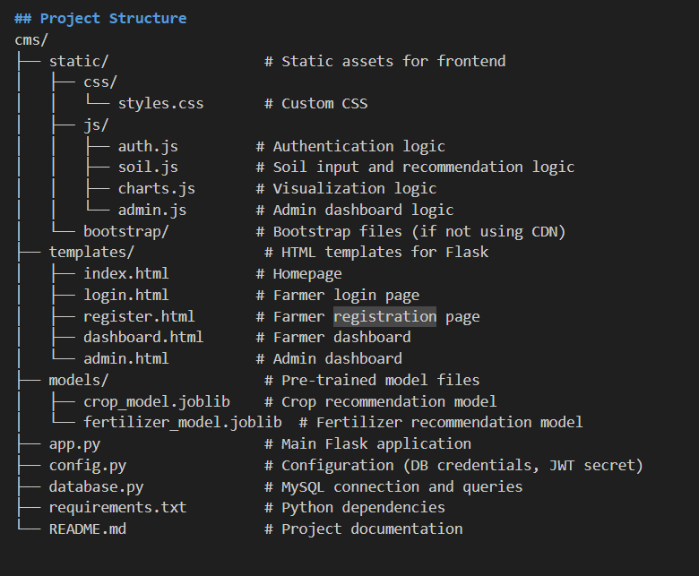

# AI-Powered Crop Management System (CMS)

## Overview

The AI-Powered Crop Management System (CMS) is a web application designed to assist farmers in making informed decisions about crop selection and fertilizer use. It provides personalized crop and fertilizer recommendations based on soil and climate data, using pre-trained machine learning models. The system includes features for farmer registration/login, soil data input, data visualization, and an admin dashboard for user management.

### Key Features
- **Farmer Authentication**: Secure registration and login using JWT.
- **Crop Recommendation**: Predicts suitable crops using a Random Forest model based on soil parameters (N, P, K, temperature, humidity, pH, rainfall).
- **Fertilizer Recommendation**: Recommends fertilizers using a Random Forest model based on soil and crop data (temperature, humidity, moisture, soil type, crop type, N, K, P).
- **Data Visualization**: Displays soil nutrient levels using Chart.js.
- **Admin Dashboard**: Allows admins to manage farmer accounts (view, edit, approve/reject, suspend/delete).
- **Deployment**: Hosted on AWS (EC2 for Flask, RDS for MySQL, S3 for static files).

## Tech Stack
- **Frontend**: HTML, CSS (Bootstrap), JavaScript, Chart.js
- **Backend**: Flask (Python)
- **Database**: MySQL
- **Machine Learning Models**: Pre-trained Random Forest models (saved with `joblib`)
- **Deployment**: AWS (EC2, RDS, S3)

## Project Structure


## Prerequisites
- **Python 3.8+**: Ensure Python is installed.
- **MySQL**: Set up a MySQL database for storing farmer and soil data.
- **AWS Account**: For deployment (EC2, RDS, S3).
- **Pre-trained Models**: `crop_model.joblib` and `fertilizer_model.joblib` should be in the `models/` directory.

## Setup Instructions

### 1. Clone the Repository
```bash
git clone <repository-url>
cd cms

2. Install Dependencies
Create a virtual environment and install the required packages:
python -m venv venv
source venv/bin/activate  # On Windows: venv\Scripts\activate
pip install -r requirements.txt

3. Set Up the MySQL Database
  1. Install MySQL and create a database:
  CREATE DATABASE cms;

  2.Update config.py with your MySQL credentials:
  MYSQL_HOST = 'localhost'  # Or your RDS endpoint
  MYSQL_USER = 'your_username'
  MYSQL_PASSWORD = 'your_password'
  MYSQL_DB = 'cms'
  3.Create the necessary tables (e.g., farmers, soil_data) using the schema in database.py.

4. Configure Environment
Set up your JWT secret in config.py:
JWT_SECRET_KEY = 'your-secret-key'  # Replace with a secure key

5. Run the Application Locally:
python app.py
Access the app at http://localhost:5000.

6. Deploy to AWS
EC2: Deploy the Flask app on an EC2 instance.
Copy the project files to EC2.
Install dependencies and run app.py using a process manager like gunicorn.
Configure a reverse proxy (e.g., Nginx).
RDS: Set up a MySQL database on RDS and update config.py with the RDS endpoint.
S3: Upload static files (static/ folder) to an S3 bucket and serve them via a CDN (e.g., CloudFront).
Set up an Application Load Balancer for scalability.


Usage
For Farmers
Register/Login: Use /register or /login to create an account or sign in.
Input Soil Data: On the dashboard, enter soil parameters (e.g., N, P, K, temperature, humidity, pH, rainfall, moisture, soil type).
Get Recommendations:
The system will recommend a crop (e.g., "Maize").
Based on the crop and soil data, it will suggest a fertilizer (e.g., "10-26").
View Visualizations: Check soil nutrient levels on the dashboard using Chart.js graphs.

For Admins
Access the admin dashboard at /admin (requires admin credentials).
Manage farmer accounts: view, edit, approve/reject, suspend, or delete.
API Endpoints
POST /api/register: Register a new farmer.
POST /api/login: Log in and receive a JWT token.
POST /api/crop-recommend: Get crop recommendation based on soil data.
POST /api/fertilizer-recommend: Get fertilizer recommendation based on soil and crop data.
GET /api/admin/farmers: List all farmers (admin only).
PUT /api/admin/edit: Edit farmer details (admin only).
POST /api/admin/approve: Approve/reject farmer accounts (admin only).
DELETE /api/admin/delete: Suspend/delete farmer accounts (admin only).

Models
Crop Recommendation: Random Forest model (crop_model.joblib) from Crop Recommendation Dataset.
Inputs: N, P, K, temperature, humidity, pH, rainfall.
Output: Crop name (e.g., "Maize").
Fertilizer Recommendation: Random Forest model (fertilizer_model.joblib) from Fertilizer Prediction Dataset.
Inputs: Temperature, humidity, moisture, soil type, crop type, N, K, P.
Output: Fertilizer type (mapped from 0/1 to "10-26"/"14-35-14").
Development Notes
Categorical Encoding: Soil type and crop type are encoded as integers (e.g., "Sandy" as 0, "Loamy" as 1).
Ensure the frontend sends encoded values or preprocess them in Flask.
Model Compatibility: Use the same scikit-learn version as in the Kaggle notebooks to avoid serialization issues.


Security: Passwords are hashed, and JWT tokens are used for authentication. Ensure the JWT secret is secure.


Future Improvements
Add more crops and fertilizers to the models.
Implement a feedback system for farmers to report recommendation outcomes.
Enhance visualizations with more detailed charts (e.g., historical trends).
Add support for real-time weather data integration.


Contributing
Fork the repository.
Create a new branch (git checkout -b feature/your-feature).
Commit your changes (git commit -m "Add your feature").
Push to the branch (git push origin feature/your-feature).
Open a pull request.
License
This project is licensed under the MIT License.

Contact
For questions or feedback, contact [johnwahome966@gmail.com].